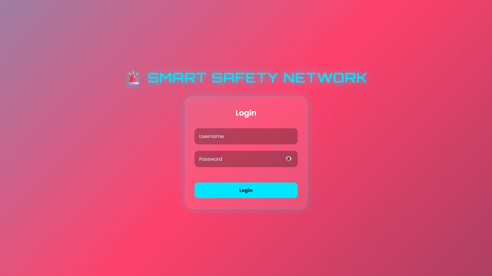
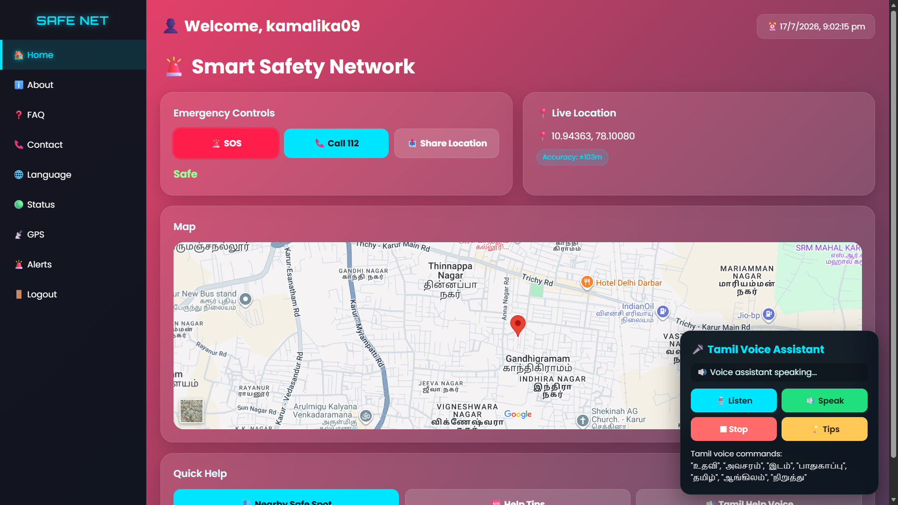
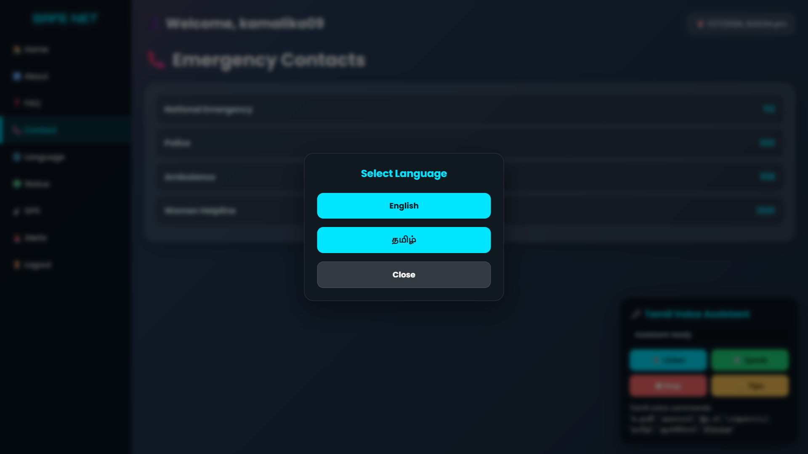
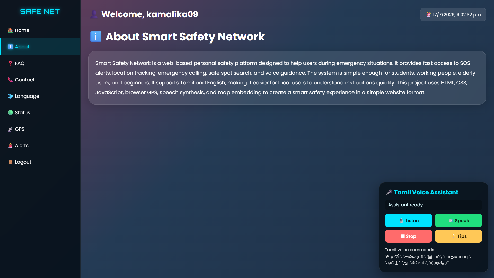
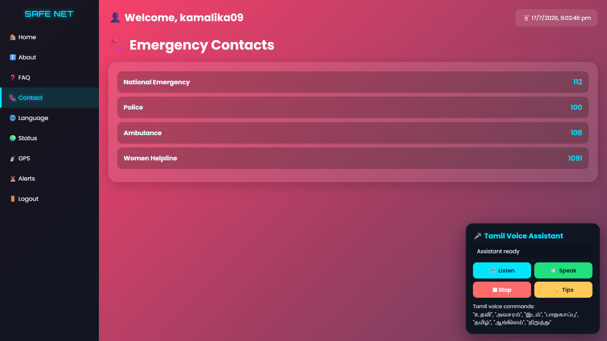
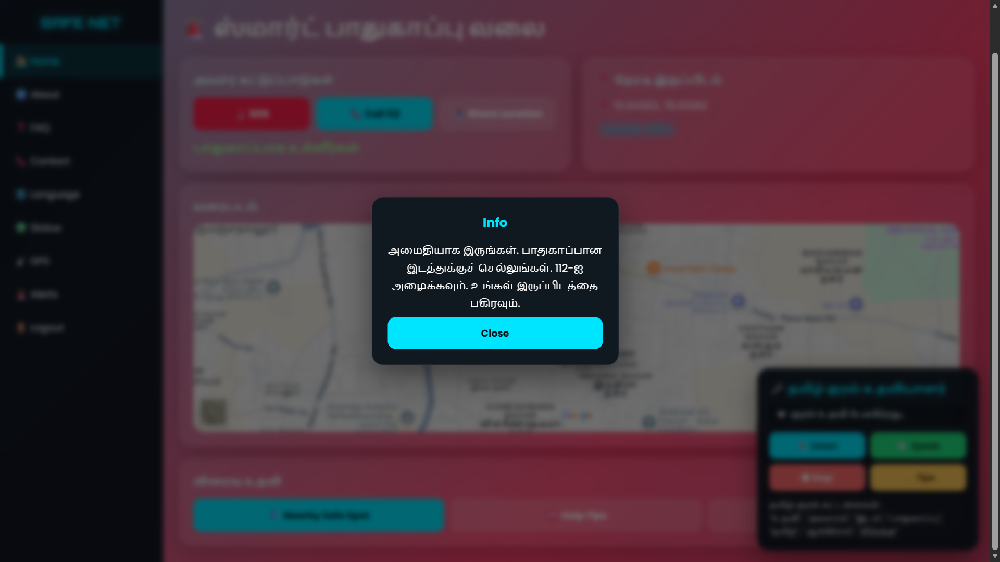
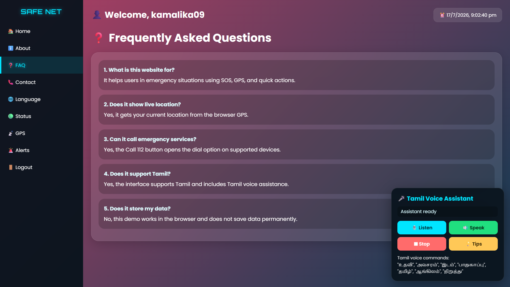
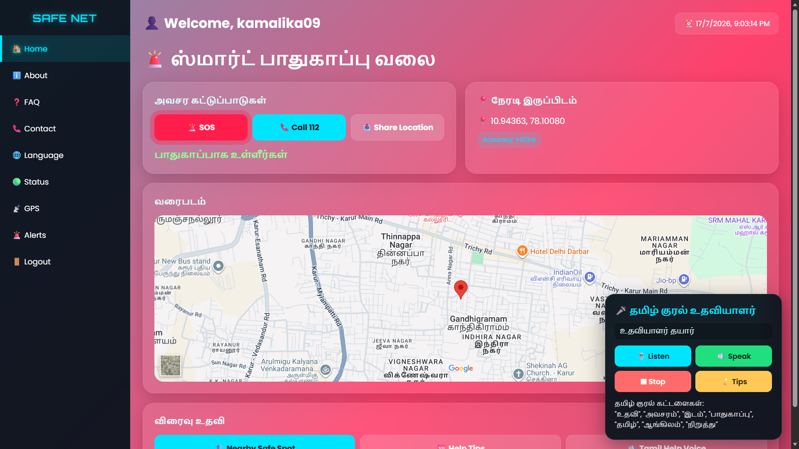

# 🚨 Smart Safety Network

A web-based personal safety application developed using **HTML, CSS, and JavaScript** to provide quick emergency assistance. The application helps users send SOS alerts, access emergency contacts, navigate using Google Maps, and use Tamil voice assistance for improved accessibility.

---

## 📌 Project Overview

**Smart Safety Network** is designed to improve personal safety by offering emergency features through a simple and user-friendly interface. It enables users to quickly seek help, share their location, and access emergency services during critical situations.

---

## ✨ Features

- 🚨 One-click SOS Emergency Button
- 📍 Live GPS Location Tracking
- 🗺️ Google Maps Integration
- 📞 Emergency Contact Buttons
- 🎤 Tamil Voice Assistant Support
- 🌐 Language Selection
- ❓ Frequently Asked Questions (FAQ)
- 💡 Safety Help Tips
- 📱 Responsive User Interface

---

## 🛠️ Technology Stack

| Technology | Purpose |
|------------|---------|
| HTML5 | Structure |
| CSS3 | Styling |
| JavaScript | Functionality |
| Google Maps API | Navigation & Location |
| Web Speech API | Voice Assistance |

---

## 📂 Project Structure

```
Smart-Safety-Network/
│
├── index.html
├── README.md
└── Screenshots/
    ├── 01-login.png
    ├── 02-dashboard.png
    ├── 03-language.png
    ├── 04-about.png
    ├── 05-contact.png
    ├── 06-help-tips.png
    ├── 07-FAQ.png
    └── 08-tamil.png
```

---

## 📸 Project Screenshots

### 🔐 Login Page



---

### 🏠 Dashboard



---

### 🌐 Language Selection



---

### ℹ️ About Page



---

### 📞 Contact Page



---

### 💡 Help Tips



---

### ❓ FAQ Page



---

### 🎤 Tamil Voice Assistant



---

## 🚀 How to Run the Project

1. Download or clone the repository.

```bash
git clone https://github.com/kamalikasenthilnaathan09/Smart-Safety-Network.git
```

2. Open the project folder.

3. Open `index.html` in your web browser.

No installation or server is required.

---

## 🎯 Future Enhancements

- 🔔 SMS Emergency Alerts
- ☁️ Cloud Database Integration
- 📱 Android Application
- 🔐 User Authentication
- 👮 Nearby Police & Hospital Finder
- 🤖 AI-based Safety Recommendations
- 🌍 Multi-language Support

---

## ⭐ If you found this project useful

Please consider giving this repository a ⭐ on GitHub!

---

## 📄 License

This project is created for educational and academic purposes.
